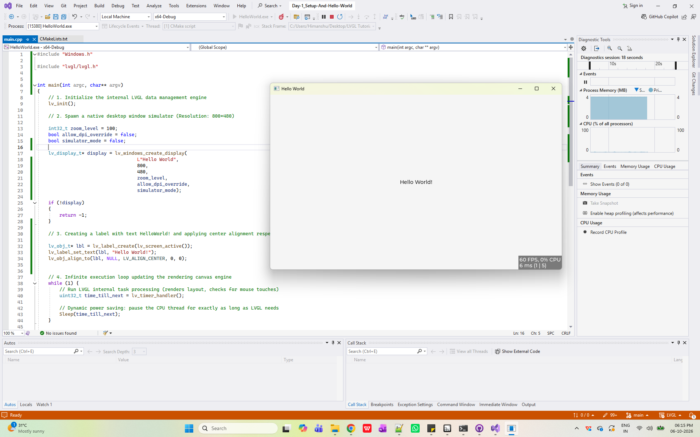

# 🚀 LVGL Learning Journey

Welcome to my LVGL (Light and Versatile Graphics Library) learning repository! Here, I document my daily progress, UI experiments, and embedded graphics concepts as I learn how to build beautiful GUIs.

---

## 📅 Day 1: Setup & Hello World 🌐

Today, I successfully configured the development environment and built my very first graphical user interface using LVGL components.

### 🛠️ What I Did Today:
* **Environment Setup:** Configured LVGL on **Windows** using the **Visual Studio IDE**.
* **Library Integration:** Cloned and linked the LVGL library with the desktop simulator.
* **Label Widget Experiment:** Created my first UI component—an `lv_label` widget—and dynamically set its text to **"HelloWorld!"** using `lv_label_set_text`.
* **Rendering & Display:** Successfully compiled the project and rendered the text on the simulator screen.

### 💻 Tech Stack Used:
* **Language:** C / C++
* **IDE:** Visual Studio
* **GUI Library:** LVGL
* **Platform:** Windows Simulator

### 📁 Today's Code Location:
The source code and project files for today's milestone can be found in the `Day-1_Setup-And-Hello-World/` folder.

### 📸 Output Screenshot:

---

## 📈 Learning Roadmap
- [x] Day 1: Windows Setup & Label Widget (HelloWorld!)
